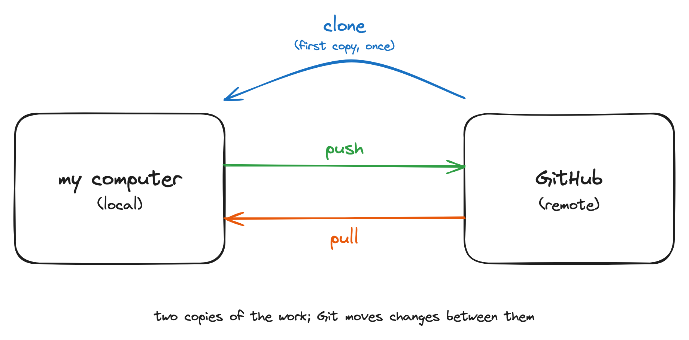
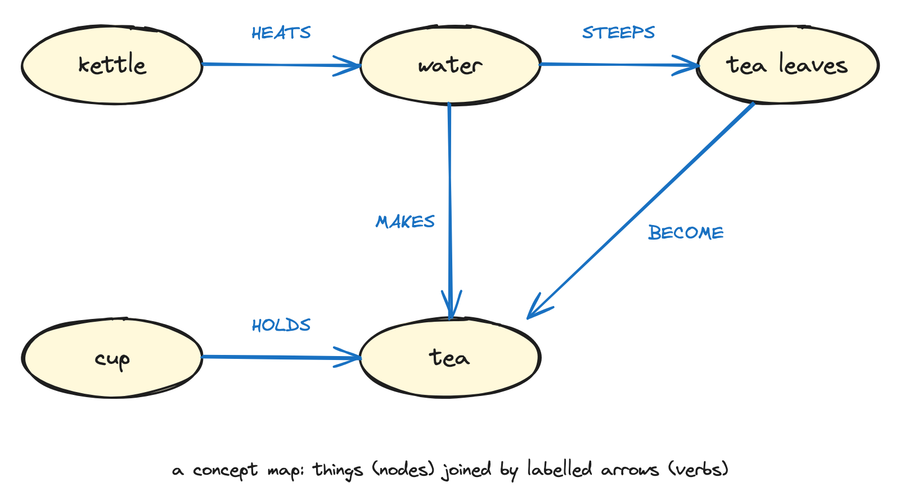

# Live visual drawings {#sec-live-drawings}

Some concepts land better when you draw them by hand, live, in front of the room, than when they appear on a finished slide. A drawing that grows as you talk lets learners watch the idea assemble. This workshop is meant to use a small set of these live drawings at key moments.

::: {.callout-important}
**These drawings are still in development.** This chapter is a set of placeholders. Each section below names a drawing, says what it should make clear, and notes when in the session to use it. Replace each placeholder with the actual drawing (a photo of a whiteboard sketch, a scan, or a digital illustration) as it is developed. Until then, treat these as the design brief.
:::

The main list of planned drawings is collected in @sec-appendix-drawings so you can see them in one place. The detail for each lives here.

## Drawing 1: Local and remote {#sec-drawing-local-remote}

**What it should make clear:** that there are two copies of the work, one on the learner's laptop (local) and one on GitHub (remote), and that Git moves changes between them. This is the mental model everything else hangs on.

**When to use it:** at the very start of the first hands-on block, before "create and clone."

**Design brief:** two boxes, "my computer" and "GitHub," with arrows labeled in the learners' own future vocabulary (push, pull, clone). Draw the clone arrow first, then add push and pull as those actions come up.

{#fig-drawing-local-remote fig-alt="Two rounded boxes labelled my computer (local) and GitHub (remote). A blue arrow labelled clone (first copy, once) curves from GitHub to my computer, a green arrow labelled push points from my computer to GitHub, and an orange arrow labelled pull points from GitHub to my computer."}

The editable source lives next to the image (`images/drawing-1-local-remote.excalidraw`). This is the digital reference version; in the room, draw it by hand.

## Drawing 2: The commit cycle {#sec-drawing-commit-cycle}

**What it should make clear:** the loop of stage, commit, push, and why a commit is a labeled snapshot rather than a save.

**When to use it:** during the "create and clone" block, the first time learners make a commit.

**Design brief:** a small loop showing working files, a staging step, a commit (drawn as a labeled box on a line), and a push to the remote. Emphasize that the line of commits is a history you can walk back along.

::: {.callout-note appearance="simple"}
*Placeholder. Insert the developed drawing here.*
:::

## Drawing 3: Branching {#sec-drawing-branching}

**What it should make clear:** that a branch is a parallel line of work that splits off and later rejoins, and that this is what makes parallel collaboration safe.

**When to use it:** at the start of the "branch" block.

**Design brief:** a main line with a branch splitting away, a couple of commits on the branch, and the branch rejoining at a merge point. Draw the split live, add commits as learners make them, then leave the merge point empty until Drawing 4.

::: {.callout-note appearance="simple"}
*Placeholder. Insert the developed drawing here.*
:::

## Drawing 4: The pull request {#sec-drawing-pull-request}

**What it should make clear:** that a pull request is a request to merge one branch into another, reviewed by a human before it happens. This is the centerpiece of the workshop, so the drawing matters most here.

**When to use it:** at the start of the "pull request and merge" block, continuing from Drawing 3.

**Design brief:** complete the merge point from Drawing 3, but pause at the join to show the review step: a person looking at the diff, approving, and only then the lines joining. Make the human-in-the-loop visible.

::: {.callout-note appearance="simple"}
*Placeholder. Insert the developed drawing here.*
:::

Progress on developing these four drawings is tracked in the issues on this handbook's repository, one issue per drawing under a parent tracking issue.

## Concept maps as bookends {#sec-concept-maps}

A concept map is a small diagram of things (nodes) joined by labelled arrows, where the label on each arrow is a verb: the kettle HEATS the water, the cup HOLDS the tea. Concept maps surface mental models. What a learner draws shows how they currently believe a system fits together, including the parts they have wired up wrongly, which no quiz question would reveal [@wilson2019teaching].

In this workshop, concept maps are used as bookends. At the start of the day, learners draw a baseline map of how a document currently travels between them and a co-author. At the end of the day, they draw a map of Git and GitHub using the vocabulary of the day, then compare the two. The comparison is the point: the closing map makes the day's learning visible to the learner, not just to the instructor.

### Introducing concept maps

Most learners have not drawn a concept map before, and without an introduction they produce flowcharts or bullet lists instead. Introduce the technique with an exemplar on an everyday topic, deliberately far away from Git, so nobody confuses learning the technique with being assessed on content:

1. Show the exemplar (below) and name its parts: nodes are things, arrows are relationships, and every arrow carries a verb label.
2. Point at one arrow and read it aloud as a sentence ("the kettle HEATS the water"). If an arrow cannot be read as a sentence, it needs a better label.
3. Say explicitly what a concept map is not: not a flowchart, not a timeline, not a list. There is no start or end, only things and how they relate.
4. Give a single, concrete prompt and a time box, then step back.

{#fig-concept-map-exemplar fig-alt="A concept map about making tea. Five oval nodes labelled kettle, water, tea leaves, cup, and tea are joined by arrows labelled with capitalised verbs: HEATS, STEEPS, BECOME, MAKES, and HOLDS."}

The editable source for this exemplar lives next to the image (`images/concept-map-exemplar.excalidraw`). Test the exemplar and your baseline prompt on one colleague before the workshop; if they hand back a flowchart or a list, the introduction needs revising, not the colleague.

### Fallback for the closing map

If the morning baseline was skipped or went badly, do not force the comparison at the end. Instead, draw the Git concept map yourself on the board as the closing recap, and ask learners to call out the verb for each arrow before you write it. The room still rehearses the vocabulary and still sees the day assembled into one picture, without anyone being put on the spot with an unfamiliar technique.
