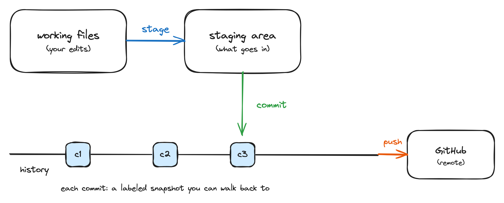
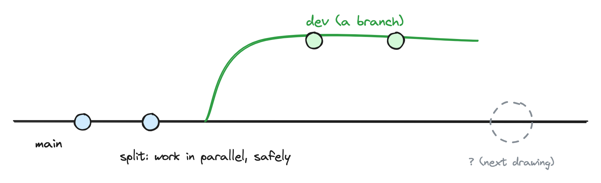
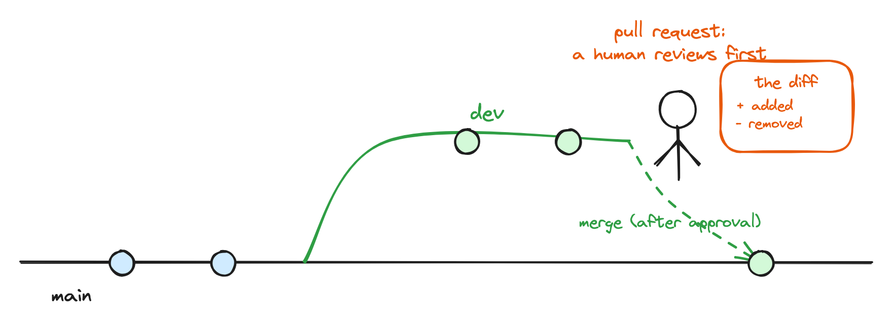

# The concept drawings {#sec-live-drawings}

Some concepts land better when learners watch them assemble piece by piece than when they appear on a finished slide. This workshop uses a small set of hand-drawn concept drawings for those moments. Each drawing is made in Excalidraw, so it keeps a hand-drawn look, and is rendered as a cumulative sequence of image frames that the slides reveal one press at a time. The idea still grows in front of the room, but from the deck, with none of the risk of drawing live under time pressure.

Each drawing is shown **as the summary at the end of its hands-on block**, not as an introduction before it. Learners first do the thing with their own hands, then watch the drawing assemble as the recap of what they just did. The build-up order of each drawing follows that logic.

::: {.callout-note appearance="simple"}
For each drawing, three kinds of files live next to the slides (in the cohort and template repositories, under `workshop/images/`): the editable `.excalidraw` source, the full drawing as one image, and the cumulative frame sequence (`-00.png` onward) that the slides stack and reveal fragment by fragment. The `README-drawings.md` in the same folder documents how to regenerate the frames after editing a source.
:::

The at-a-glance index of all four drawings is in @sec-appendix-drawings. The detail for each lives here.

## Drawing 1: Local and remote {#sec-drawing-local-remote}

**What it should make clear:** that there are two copies of the work, one on the learner's laptop (local) and one on GitHub (remote), and that Git moves changes between them. This is the mental model everything else hangs on.

**When to use it:** as the summary at the end of the "create and clone" block, after learners have cloned their own repository.

**Design brief:** two boxes, "my computer" and "GitHub," with arrows labeled in the learners' own new vocabulary (clone, push, pull). The reveal order: the two repositories, then the clone arrow, then push and pull.

{#fig-drawing-local-remote fig-alt="Two rounded boxes labelled my computer (local) and GitHub (remote). A blue arrow labelled clone (first copy, once) curves from GitHub to my computer, a green arrow labelled push points from my computer to GitHub, and an orange arrow labelled pull points from GitHub to my computer."}

The editable source lives next to the image (`images/drawing-1-local-remote.excalidraw`).

## Drawing 2: The commit cycle {#sec-drawing-commit-cycle}

**What it should make clear:** the loop of stage, commit, push, and why a commit is a labeled snapshot rather than a save.

**When to use it:** as the summary at the end of the commit-cycle block, after learners have pushed their first commits.

**Design brief:** a small loop showing working files, a staging step, a commit (drawn as a labeled box on a line), and a push to the remote. The reveal order: working files, stage, the commit snapshot, the history line growing, then push. Emphasize that the line of commits is a history you can walk back along.

{#fig-drawing-commit-cycle fig-alt="Two rounded boxes labelled working files (your edits) and staging area (what goes in), joined by a blue arrow labelled stage. A green arrow labelled commit points down from the staging area onto a horizontal history line carrying three labelled snapshot boxes c1, c2, and c3. An orange arrow labelled push leads from the history line to a box labelled GitHub (remote). A caption reads: each commit, a labeled snapshot you can walk back to."}

The editable source lives next to the image (`images/drawing-2-commit-cycle.excalidraw`).

## Drawing 3: Branching {#sec-drawing-branching}

**What it should make clear:** that a branch is a parallel line of work that splits off and later rejoins, and that this is what makes parallel collaboration safe.

**When to use it:** as the summary at the end of the "branch" block, with the merge point deliberately left empty.

**Design brief:** a main line with a branch splitting away, a couple of commits on the branch, and an empty merge point. The reveal order: the main line, the split, commits landing on the branch, then the open question at the merge point. Say out loud that the picture is finished in the next block.

{#fig-drawing-branching fig-alt="A horizontal black line labelled main with two blue commit dots. A green line labelled dev (a branch) splits away upward and carries two green commit dots. A dashed grey circle sits on the main line to the right with the caption: question mark, next drawing. A label reads: split, work in parallel, safely."}

The editable source lives next to the image (`images/drawing-3-branching.excalidraw`). Present this one and Drawing 4 as one continued story; they share the scene.

## Drawing 4: The pull request {#sec-drawing-pull-request}

**What it should make clear:** that a pull request is a request to merge one branch into another, reviewed by a human before it happens. This is the centerpiece of the workshop, so the drawing matters most here.

**When to use it:** as the summary at the end of the "pull request, review, merge" block, continuing from Drawing 3.

**Design brief:** complete the merge point from Drawing 3, but pause at the join to show the review step: a person looking at the diff, approving, and only then the lines joining. The reveal order: the open merge point, the pull request, the human review at the join, then the merge. Make the human-in-the-loop visible.

{#fig-drawing-pull-request fig-alt="The branching picture from drawing 3, completed. The green dev line stops short of the main line. A stick figure stands at the gap next to an orange box labelled the diff with plus added and minus removed lines. Above them a label reads: pull request, a human reviews first. A dashed green arrow labelled merge (after approval) joins the dev line onto the main line at a green commit dot."}

The editable source lives next to the image (`images/drawing-4-pull-request.excalidraw`). This drawing carries the centerpiece block; the pause at the review is where to slow down and let the room look.

## Concept maps as bookends {#sec-concept-maps}

A concept map is a small diagram of things (nodes) joined by labelled arrows, where the label on each arrow is a verb: the kettle HEATS the water, the cup HOLDS the tea. Concept maps surface mental models. What a learner draws shows how they currently believe a system fits together, including the parts they have wired up wrongly, which no quiz question would reveal [@wilson2019teaching].

In this workshop, concept maps are used as bookends. At the start of the day, learners draw a baseline map of how a document currently travels between them and a co-author. At the end of the day, they draw a map of Git and GitHub using the vocabulary of the day, then compare the two. The comparison is the point: the closing map makes the day's learning visible to the learner, not just to the instructor.

Unlike the four drawings above, the concept maps are drawn by hand in the room: by the learners on paper, and by you on the whiteboard only in the fallback described below. Plan the materials for this (paper, pens, wall space to pin the maps) in the pre-flight checklist (@sec-before).

### Introducing concept maps

Most learners have not drawn a concept map before, and without an introduction they produce flowcharts or bullet lists instead. Introduce the technique with an exemplar on an everyday topic, deliberately far away from Git, so nobody confuses learning the technique with being assessed on content:

1. Show the exemplar (below) and name its parts: nodes are things, arrows are relationships, and every arrow carries a verb label.
2. Point at one arrow and read it aloud as a sentence ("the kettle HEATS the water"). If an arrow cannot be read as a sentence, it needs a better label.
3. Say explicitly what a concept map is not: not a flowchart, not a timeline, not a list. There is no start or end, only things and how they relate.
4. Give a single, concrete prompt and a time box, then step back.

{#fig-concept-map-exemplar fig-alt="A concept map about making tea. Five oval nodes labelled kettle, water, tea leaves, cup, and tea are joined by arrows labelled with capitalised verbs: HEATS, STEEPS, BECOME, MAKES, and HOLDS."}

The editable source for this exemplar lives next to the image (`images/concept-map-exemplar.excalidraw`). Test the exemplar and your baseline prompt on one colleague before the workshop; if they hand back a flowchart or a list, the introduction needs revising, not the colleague.

### Fallback for the closing map

If the morning baseline was skipped or went badly, do not force the comparison at the end. Instead, draw the Git concept map yourself on the board as the closing recap, and ask learners to call out the verb for each arrow before you write it. The room still rehearses the vocabulary and still sees the day assembled into one picture, without anyone being put on the spot with an unfamiliar technique.
